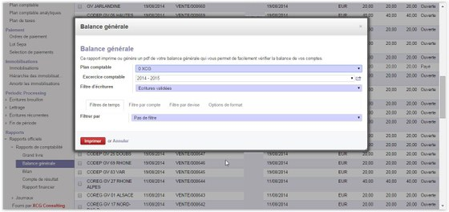
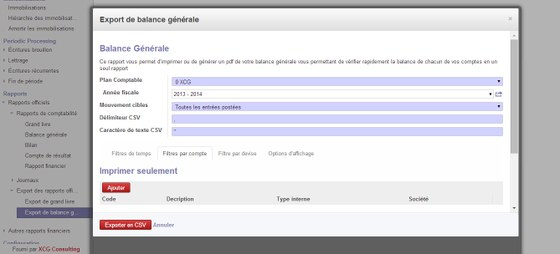
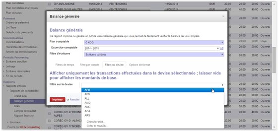
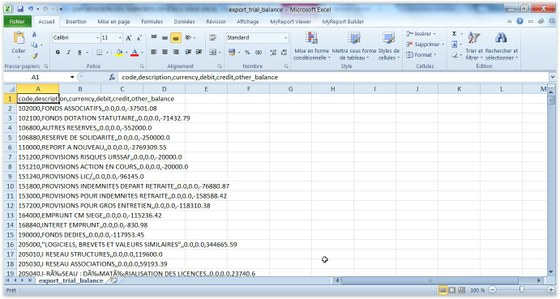

### README ###

### Export reports as CSV for Odoo/OpenERP ###

A full article (in French) [is available online](http://www.xcg-consulting.fr/blog/export-des-rapports-officiels-sur-odoo/) to understand what this module provides

### Main Improvements ###

Export General Ledger/Trial Balance as CSV

Provides ability to filter data by:

* Accounts:
 

* Currency:
 

* Period

Then Export your selected data in CSV:

 
